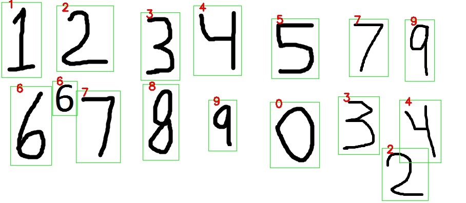

# multi-digit-recognition
multi digit recognition using keras cnn and openCV  

using opencv library ot detect the digits in the image using cv2.contours  
then using pretrained CNN with keras to predict the digit  

#usage 
to detect multidigt you change the content of the 'images/image.jpg' 

then run the 'run.py'  script

and a new image will be created in the image2 directory

